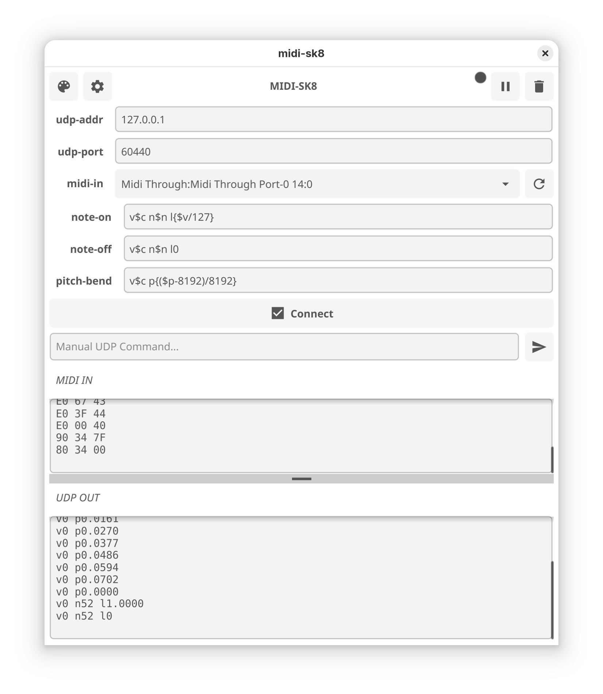

# `midi-sk8` - mutate MIDI into `skred` over UDP


*hit pads and keys you your metal and plastic devices*

# quick

```
# install go1.25.5 and fyne
# go install fyne.io/tools/cmd/fyne@latest
cd src
make
./build/TARGET/midisk8
```


